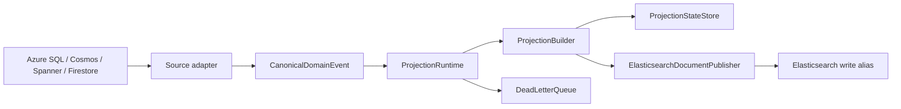
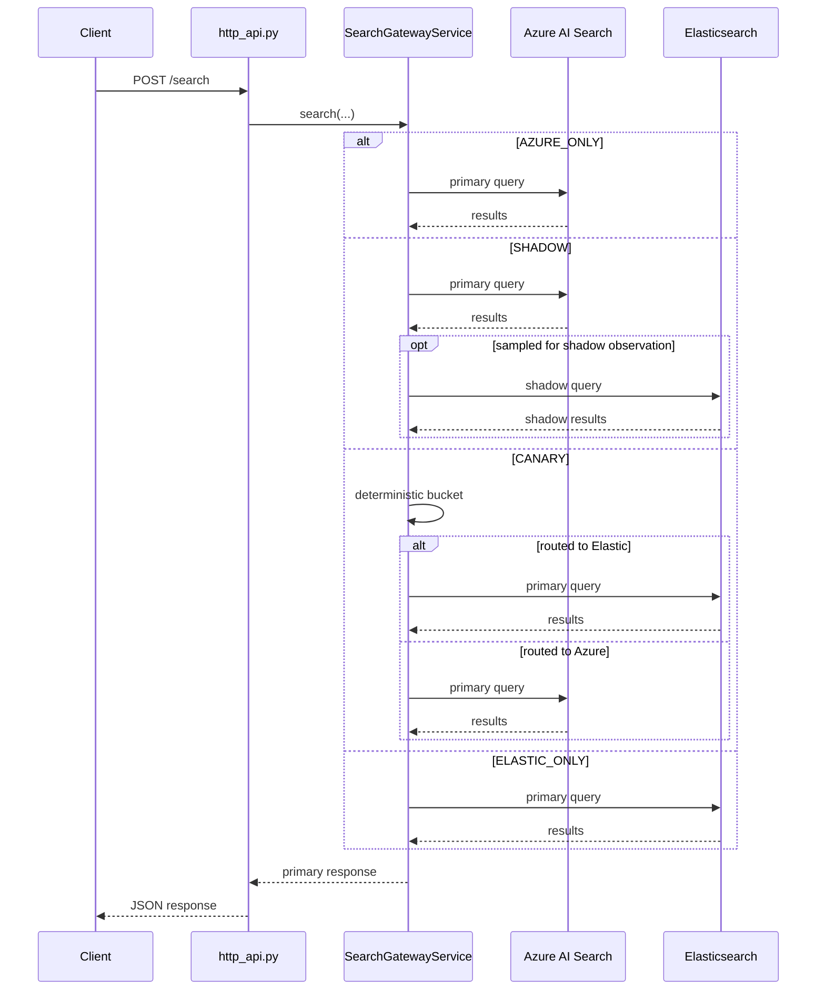

# Unified Modernization Platform - Developer Guide

> Audience: engineers onboarding to the codebase.
> Goal: explain the current repo shape, the real runtime surfaces, and the safest ways to extend or deploy the platform.

## 1. What This Repository Actually Ships

This repository now contains four distinct layers:

1. Source adapters that normalize Azure SQL / Debezium, Cosmos, Spanner, and Firestore outbox records into one canonical event contract.
2. A projection pipeline that assembles fragment state, applies backpressure and DLQ handling, and can publish search documents to Elasticsearch.
3. A search gateway that can run in translation-only mode or as a real HTTP service with `/search`, `/translate`, and `/health`.
4. GCP deployment infrastructure for the pilot gateway footprint: Cloud Run, Spanner, Firestore, Pub/Sub, Artifact Registry, and Secret Manager.

What the repo still does not ship is a dedicated projection-consumer worker process that reads Pub/Sub end to end in production. The Terraform stack provisions that substrate, but not a fake worker.

## 2. Canonical Documents

Use these as the source of truth:

- `DEVELOPER_GUIDE.md` - developer-facing codebase and runtime guide
- `TECHNICAL_PRIMER.md` - semi-technical system and operations primer
- `docs/EXECUTIVE_GUIDE.md` - executive and business stakeholder guide
- `ARCHITECTURE_DECISIONS.md` - canonical ADR set
- `docs/TERRAFORM_DEPLOYMENT.md` - deployment and rollout guide

The following files are retained only as compatibility pointers and should not be treated as separate sources of truth:

- `PLATFORM_OVERVIEW.md`
- `docs/PRODUCT_OPERATIONS_PRIMER.md`
- `docs/ADR_COMPENDIUM.md`

## 3. Repository Layout

```text
src/unified_modernization/
  adapters/         CDC and outbox normalization
  backfill/         bulk side-load and stream handoff planning
  config/           YAML-driven domain onboarding
  contracts/        canonical event, projection, and state models
  cutover/          backend/search finite state machines and durable stores
  gateway/          translation surface, HTTP gateway, search clients, service
  observability/    telemetry protocol and OTLP bridge
  projection/       builder, runtime, publisher, and state stores
  reconciliation/   flat and bucketed anti-entropy engines
  routing/          tenant routing and ingestion partition policy
tests/
  test_asgi.py
  test_gateway.py
  test_http_api.py
  test_projection.py
  test_projection_runtime.py
  test_reconciliation.py
  ...
infra/terraform/
  Cloud Run, Spanner, Firestore, Pub/Sub, Secret Manager, Artifact Registry
docs/
  EXECUTIVE_GUIDE.md
  TERRAFORM_DEPLOYMENT.md
```

## 4. Core Runtime Surfaces

### 4.1 Translation-Only ASGI Surface

File: `src/unified_modernization/gateway/asgi.py`

This surface exists for OData translation only.

- `GET /health`
- `POST /translate`
- API-key enforcement and body-size limits
- no backend routing
- no traffic-mode logic
- no shadow or canary behavior

Entry point:

```bash
uvicorn unified_modernization.gateway.asgi:app --app-dir src --reload
```

Config surface:

- `GATEWAY_ENVIRONMENT`
- `GATEWAY_API_KEYS`
- `GATEWAY_MAX_BODY_BYTES`
- `GATEWAY_FIELD_MAP`

### 4.2 Deployable HTTP Gateway

File: `src/unified_modernization/gateway/http_api.py`

This is the actual deployable search service in the current repo.

Routes:

- `GET /health`
- `POST /translate`
- `POST /search`

Request body for `/search`:

```json
{
  "consumer_id": "web-frontend",
  "tenant_id": "acme",
  "entity_type": "customerDocument",
  "params": {
    "$search": "gold customer",
    "$filter": "Status eq 'ACTIVE'",
    "$top": "10"
  }
}
```

Production behavior:

- in `prod` / non-local environments, bootstrap failures raise and fail startup
- in `local`, `dev`, and `test`, bootstrap failures are logged and `/search` returns `503 SEARCH_GATEWAY_NOT_CONFIGURED`

Entry point:

```bash
uvicorn unified_modernization.gateway.http_api:app --app-dir src --reload
```

### 4.3 SearchGatewayService

Files:

- `src/unified_modernization/gateway/service.py`
- `src/unified_modernization/gateway/bootstrap.py`

This is the routing and evaluation engine behind the HTTP gateway.

It owns:

- `TrafficMode` evaluation
- deterministic canary routing
- shadow observation sampling
- judged relevance gating
- per-backend circuit breakers and retries
- tenant alias and routing-key resolution

Important implementation detail:

- the service is env-driven, not Firestore-driven
- it does not read cutover state from Firestore on each request
- current mode comes from `UMP_GATEWAY_*` configuration at startup

## 5. End-to-End Data Flow

### 5.1 Event Ingestion Path



Hot-path rules:

- source ordering uses native source version where possible
- stale or missing fragments stay pending
- duplicate content does not advance `projection_version`
- publish failures route to the application DLQ
- backpressure defaults to `100_000` pending documents
- `REPAIR` and `REFRESH` bypass backpressure

### 5.2 Search Query Path



Important clarification:

- `SHADOW` does not always mean 100 percent shadow load in deployed environments
- actual shadow execution is controlled by `UMP_GATEWAY_SHADOW_OBSERVATION_PERCENT`
- `CANARY` routes a deterministic subset directly to Elasticsearch as primary, not “Azure primary plus Elastic compare for everyone”

## 6. State and Integrity Model

### 6.1 Projection State

Files:

- `src/unified_modernization/contracts/projection.py`
- `src/unified_modernization/projection/store.py`

Production state store:

- `SpannerProjectionStateStore`

Important fields:

- `projection_version`
- `entity_revision`
- `last_payload_hash`
- `last_built_utc`
- `last_published_utc`
- `last_source_change_utc`
- `quarantine_at_utc`

Status model:

- `PENDING_REQUIRED_FRAGMENT`
- `PENDING_REHYDRATION`
- `READY_TO_BUILD`
- `PUBLISHED`
- `STALE`
- `DELETED`
- `QUARANTINED`

### 6.2 Cutover State

Files:

- `src/unified_modernization/cutover/state_machine.py`
- `src/unified_modernization/cutover/bootstrap.py`

Production cutover store:

- `FirestoreCutoverStateStore`

Important current behavior:

- append-only transition log plus latest-state snapshot
- latest-state updates are transactional
- backend and search tracks are independent
- invalid transitions raise immediately

## 7. Configuration Surfaces

The runtime is split across four config surfaces. Do not flatten these mentally.

### 7.1 ASGI Translation Surface

Prefix: `GATEWAY_*`

- `GATEWAY_ENVIRONMENT`
- `GATEWAY_API_KEYS`
- `GATEWAY_MAX_BODY_BYTES`
- `GATEWAY_FIELD_MAP`

### 7.2 Search Gateway Integration

Prefix: `UMP_*`

- `UMP_ENVIRONMENT`
- `UMP_GATEWAY_MODE`
- `UMP_GATEWAY_CANARY_PERCENT`
- `UMP_GATEWAY_AUTO_DISABLE_CANARY_ON_REGRESSION`
- `UMP_GATEWAY_SHADOW_OBSERVATION_PERCENT`
- `UMP_GATEWAY_AZURE_TIMEOUT_SECONDS`
- `UMP_GATEWAY_ELASTIC_TIMEOUT_SECONDS`
- `UMP_GATEWAY_MAX_RETRIES`
- `UMP_GATEWAY_FAILURE_THRESHOLD`
- `UMP_GATEWAY_RECOVERY_TIMEOUT_SECONDS`
- `UMP_GATEWAY_FIELD_MAP`
- `UMP_DEDICATED_TENANTS`
- `UMP_AZURE_SEARCH_*`
- `UMP_ELASTICSEARCH_*`

### 7.3 Projection Publisher

Prefix: `UMP_PUBLISHER_*`

- `UMP_PUBLISHER_ENDPOINT`
- `UMP_PUBLISHER_API_KEY`
- `UMP_PUBLISHER_BEARER_TOKEN`
- `UMP_PUBLISHER_REFRESH`
- `UMP_PUBLISHER_WRITE_ALIAS_MAP`

Also consumed:

- `UMP_DEDICATED_TENANTS`

### 7.4 Telemetry

Prefix: `UMP_*`

- `UMP_TELEMETRY_MODE`
- `UMP_TELEMETRY_SERVICE_NAME`
- `UMP_OTLP_COLLECTOR_ENDPOINT`
- `UMP_OTLP_HEADERS`

## 8. Local Development

### 8.1 Install

```bash
python -m pip install -e .[dev]
```

### 8.2 Run the translation-only ASGI app

```bash
uvicorn unified_modernization.gateway.asgi:app --app-dir src --reload
```

### 8.3 Run the deployable HTTP gateway

```bash
uvicorn unified_modernization.gateway.http_api:app --app-dir src --reload
```

### 8.4 Build the gateway service directly

```bash
export UMP_ENVIRONMENT=dev
export UMP_GATEWAY_MODE=azure_only
export UMP_AZURE_SEARCH_ENDPOINT=https://your-service.search.windows.net
export UMP_AZURE_SEARCH_API_KEY=your-key
export UMP_ELASTICSEARCH_ENDPOINT=http://localhost:9200

python -c "
from unified_modernization.gateway.bootstrap import build_http_search_gateway_service_from_env
service = build_http_search_gateway_service_from_env()
print(type(service).__name__)
print(service.canary_frozen)
"
```

### 8.5 Run tests and checks

```bash
# full test suite
pytest

# lint
python -m ruff check src tests

# strict type checking
python -m mypy src --strict --ignore-missing-imports
```

Current validated suite size: `104` tests.

## 9. Deployment Reality

The repo now ships:

- a root `Dockerfile`
- a deployable HTTP gateway
- a Terraform stack under `infra/terraform`

The Terraform stack provisions:

- Cloud Run gateway service
- Cloud Run harness job
- Artifact Registry
- Secret Manager
- Spanner for projection state
- Firestore for cutover state
- Pub/Sub substrate for a future projection worker

The repo still does not ship:

- a dedicated production projection-consumer runtime
- a full CI/CD rollout pipeline
- live environment credentials

## 10. Operational Notes

- `409` from Elasticsearch external versioning is currently treated as a publish failure and routed to the DLQ for review.
- `ProjectionRuntime` uses application-level backpressure and bypasses it for `REPAIR`, `REFRESH`, and in-flight incomplete entities.
- `SearchGatewayService` circuit breaker state is per process instance.
- `projection.time_to_completeness` includes historical age during backfill; do not treat it as pure online latency.

## 11. Where To Go Next

- For business context: `docs/EXECUTIVE_GUIDE.md`
- For semi-technical architecture and runbooks: `TECHNICAL_PRIMER.md`
- For design rationale: `ARCHITECTURE_DECISIONS.md`
- For deployment: `docs/TERRAFORM_DEPLOYMENT.md`
