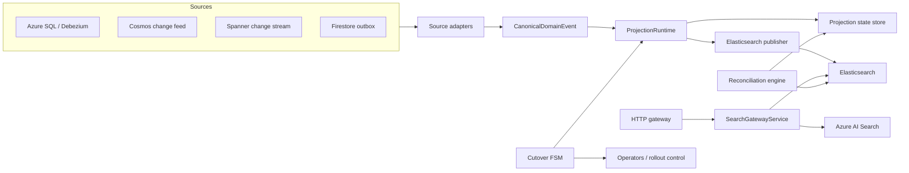
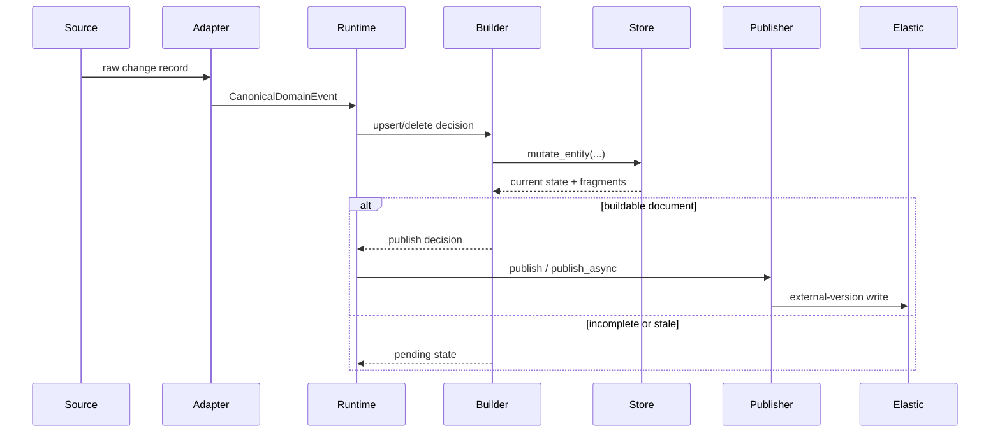
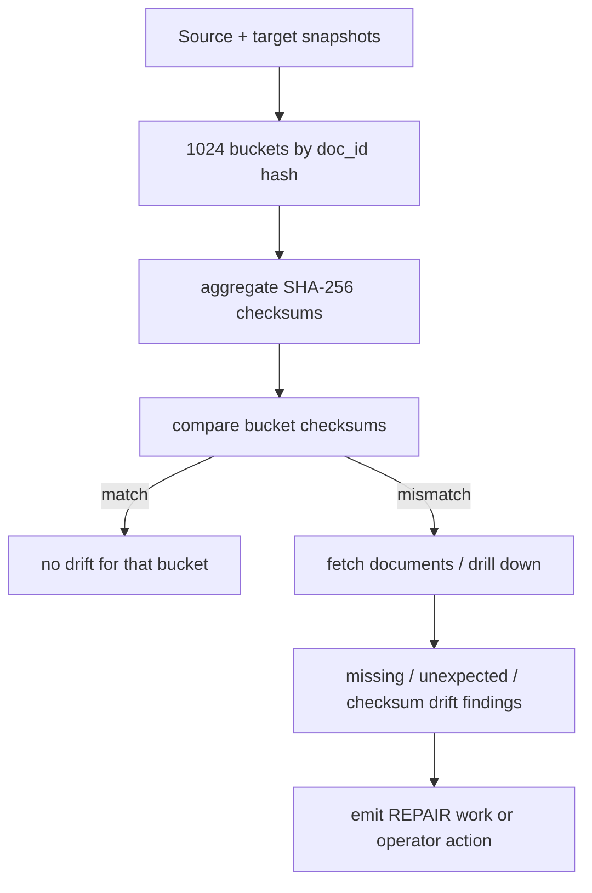

# Unified Modernization Platform - Technical Primer

> Audience: product owners, operations leads, technical program managers, and engineers who need a system-level view without reading every module.

## 1. System at a Glance

The platform has two independent migration tracks:

- backend migration: Azure SQL / Cosmos to GCP stores
- search migration: Azure AI Search to Elasticsearch

Those tracks share one event and control backbone, but they do not have to move at the same speed.



## 2. What Runs Today

### 2.1 Translation-Only Surface

`src/unified_modernization/gateway/asgi.py`

Endpoints:

- `GET /health`
- `POST /translate`

Purpose:

- OData translation only
- API-key and body-limit middleware
- no backend routing

### 2.2 Deployable HTTP Gateway

`src/unified_modernization/gateway/http_api.py`

Endpoints:

- `GET /health`
- `POST /translate`
- `POST /search`

Purpose:

- HTTP transport for `SearchGatewayService`
- current Cloud Run deployment target
- fails closed in production-style environments if bootstrap is invalid

### 2.3 Search Routing Engine

`src/unified_modernization/gateway/service.py`

Purpose:

- traffic-mode decisions
- deterministic canary routing
- shadow observation sampling
- judged relevance quality gate
- per-backend resilience

Important current behavior:

- it is env-driven, not Firestore-driven
- it does not read migration state from Firestore on each request

## 3. Change Event Path



Key rules:

- native source ordering is preferred over timestamps
- incomplete entities stay pending
- stale required fragments move entities into a rehydration path
- duplicate content does not advance publish version
- publish failures route to the application DLQ

## 4. Search Path

### 4.1 HTTP Request Shape

Current `/search` request body:

```json
{
  "consumer_id": "web-app",
  "tenant_id": "acme",
  "entity_type": "customerDocument",
  "params": {
    "$search": "John Smith",
    "$filter": "Status eq 'ACTIVE'",
    "$top": "10"
  }
}
```

### 4.2 Traffic Modes

| Mode | Primary backend | Shadow behavior |
|---|---|---|
| `AZURE_ONLY` | Azure | none |
| `SHADOW` | Azure | Elastic queried only when sampled in |
| `CANARY` | Azure or Elastic, based on deterministic bucket | opposite backend queried only when sampled in |
| `ELASTIC_ONLY` | Elastic | none |

Important nuance:

- `SHADOW` is not always 100 percent dual-query in deployed environments
- `UMP_GATEWAY_SHADOW_OBSERVATION_PERCENT` controls how many requests actually run the shadow comparison
- in `CANARY`, a deterministic subset is routed directly to Elasticsearch as primary

### 4.3 Gateway Health

The current deployable gateway does have a dedicated health endpoint:

- `GET /health` on `http_api.py`

That is separate from the translation-only health endpoint in `asgi.py`.

## 5. Cutover and Control Plane

Each domain has two independent state machines:

- backend primary state
- search serving state

Production persistence:

- Firestore via `FirestoreCutoverStateStore`

Current guarantees:

- append-only transition log
- latest-state snapshot
- transactional latest-state updates
- explicit rollback paths where supported

## 6. Reconciliation and Repair

The reconciliation engine compares source and target views without scanning every document in the healthy case.



Operational takeaway:

- healthy runs are cheap
- only drifted buckets open into detailed comparison
- repair is performed by reprojecting affected entity IDs

## 7. Runtime Configuration

### 7.1 ASGI Translation Surface

Prefix: `GATEWAY_*`

- `GATEWAY_ENVIRONMENT`
- `GATEWAY_API_KEYS`
- `GATEWAY_MAX_BODY_BYTES`
- `GATEWAY_FIELD_MAP`

### 7.2 Search Gateway

Prefix: `UMP_*`

- `UMP_ENVIRONMENT`
- `UMP_GATEWAY_MODE`
- `UMP_GATEWAY_CANARY_PERCENT`
- `UMP_GATEWAY_SHADOW_OBSERVATION_PERCENT`
- `UMP_GATEWAY_AZURE_TIMEOUT_SECONDS`
- `UMP_GATEWAY_ELASTIC_TIMEOUT_SECONDS`
- `UMP_GATEWAY_MAX_RETRIES`
- `UMP_GATEWAY_FAILURE_THRESHOLD`
- `UMP_GATEWAY_RECOVERY_TIMEOUT_SECONDS`
- `UMP_AZURE_SEARCH_*`
- `UMP_ELASTICSEARCH_*`

### 7.3 Publisher

Prefix: `UMP_PUBLISHER_*`

- `UMP_PUBLISHER_ENDPOINT`
- `UMP_PUBLISHER_API_KEY`
- `UMP_PUBLISHER_BEARER_TOKEN`
- `UMP_PUBLISHER_REFRESH`
- `UMP_PUBLISHER_WRITE_ALIAS_MAP`

### 7.4 Telemetry

Prefix: `UMP_*`

- `UMP_TELEMETRY_MODE`
- `UMP_TELEMETRY_SERVICE_NAME`
- `UMP_OTLP_COLLECTOR_ENDPOINT`
- `UMP_OTLP_HEADERS`

## 8. Operational Signals

Important metrics and events:

- `projection.backpressure.rejected`
- `projection.publish_failed`
- `projection.time_to_completeness`
- `search.gateway.canary_auto_disabled`
- `search.shadow.regression`
- `search.backend.circuit_opened`
- `backend_failure`
- `circuit_open`
- `circuit_half_open`
- `circuit_closed`

Important nuance:

- `projection.time_to_completeness` includes historical age during backfill; it is not pure online latency
- circuit-breaker state is per process instance

## 9. Deployment Topology

What the repo can deploy today:

- Cloud Run HTTP gateway
- Cloud Run harness job
- Spanner projection-state substrate
- Firestore cutover-state store
- Pub/Sub substrate for future worker wiring

What the repo does not deploy today:

- a dedicated projection-consumer worker process

## 10. Practical Runbook Summary

### Before pilot traffic

- verify Azure and Elastic credentials
- deploy the HTTP gateway, not just `asgi.py`
- keep `gateway_allow_unauthenticated = false`
- use `telemetry_mode=logger` or `otlp_http`
- start with `SHADOW`

### If search quality regresses

- keep Azure as primary
- inspect `search.shadow.regression` and `search.gateway.canary_auto_disabled`
- review judged relevance inputs
- only re-enable canary after explicit sign-off

### If projection failures rise

- inspect the DLQ
- investigate `projection.publish_failed`
- use `REPAIR` for targeted corrective re-evaluation

## 11. Related Documents

- `DEVELOPER_GUIDE.md` for module-level detail
- `docs/EXECUTIVE_GUIDE.md` for business context
- `ARCHITECTURE_DECISIONS.md` for design rationale
- `docs/TERRAFORM_DEPLOYMENT.md` for deployment and rollout steps
