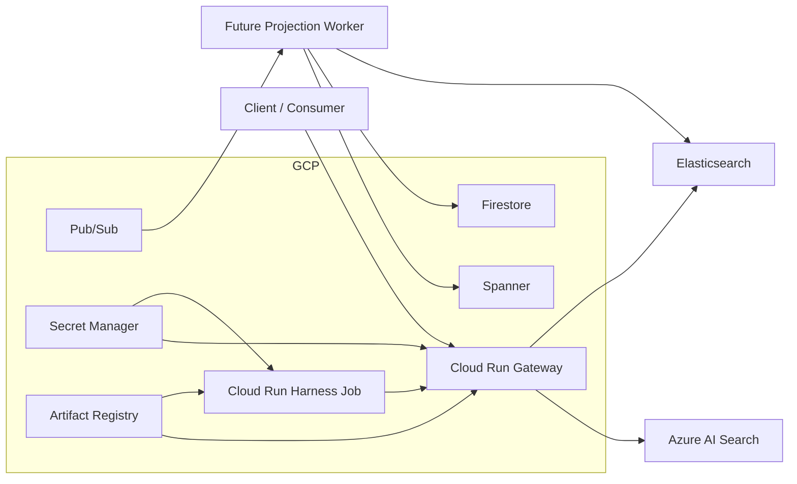
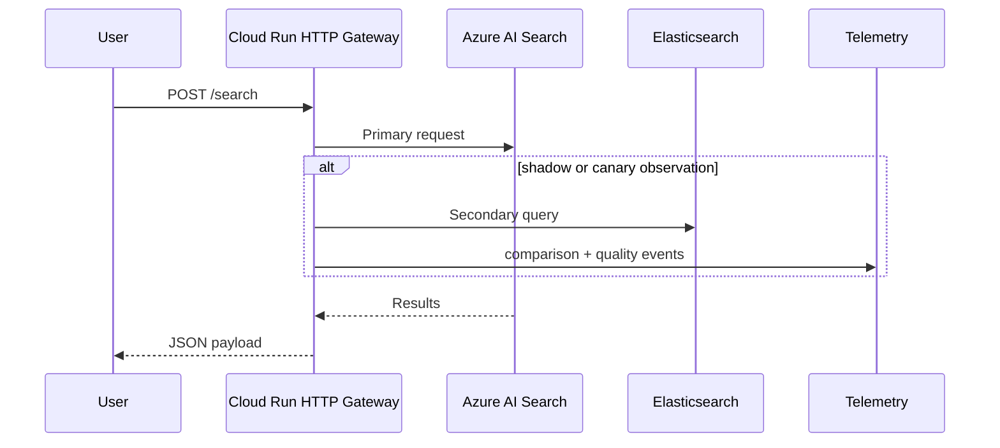

# Terraform Deployment Guide

This guide describes how to deploy the current repository with Terraform in a way that matches the code as it exists today.

## Scope

The Terraform stack provisions the GCP platform substrate plus the currently deployable workloads:

- HTTP search gateway on Cloud Run using `unified_modernization.gateway.http_api:app`
- gateway harness as a Cloud Run Job
- Spanner for projection state
- Firestore for cutover state
- Pub/Sub topics and subscription for future projection runtime wiring
- Artifact Registry, Secret Manager, and service accounts

The stack does not invent a projection worker deployment that the repo does not yet have. Instead, it provisions the worker substrate and outputs the configuration needed once that runtime exists.

## Deployment architecture



## Build the image

The repo now contains a root [Dockerfile](../Dockerfile) that installs the package with the `gcp` and `telemetry` extras and starts the HTTP gateway app by default.

Example:

```powershell
gcloud builds submit --tag us-central1-docker.pkg.dev/<project>/<repo>/unified-modernization-platform:latest .
```

Use the same image for the Cloud Run service and the harness job unless you have a reason to split them.

## Configure Terraform

Start from [terraform.tfvars.example](../infra/terraform/terraform.tfvars.example).

Required inputs:

- `project_id`
- `region`
- `spanner_config`
- `firestore_location`
- `gateway_image`
- `azure_search_endpoint`
- `azure_search_default_index`
- `elasticsearch_endpoint`
- `elasticsearch_default_index`
- one of `secret_values.*` or `secret_version_refs.*` for:
  - `azure_search_credential`
  - `elasticsearch_credential`
  - `gateway_api_keys` outside `local` / `dev` / `test`

## Secret model

The stack provisions these Secret Manager secrets:

- `gateway_api_keys`
- `azure_search_credential`
- `elasticsearch_credential`
- `publisher_credential`
- `otlp_headers`

The credential content depends on the selected auth mode:

- `azure_search_auth_mode = "api_key"` means `azure_search_credential` contains the Azure Search API key
- `azure_search_auth_mode = "bearer_token"` means `azure_search_credential` contains the Azure bearer token
- `elasticsearch_auth_mode = "api_key"` means `elasticsearch_credential` contains the Elastic API key
- `elasticsearch_auth_mode = "bearer_token"` means `elasticsearch_credential` contains the Elastic bearer token

Supported workflows:

1. Terraform-managed bootstrap
   Put the values in `secret_values`, let Terraform create the secret versions, then deploy.
2. External secret lifecycle
   Point Terraform at existing Secret Manager version aliases or numbers with `secret_version_refs`.

Rules:

- Use either `secret_values` or `secret_version_refs` for a given secret key, not both.
- Terraform still manages the secret containers. `secret_version_refs` controls which existing secret version Cloud Run mounts.

Recommended out-of-band secret workflow:

1. Apply once with `deploy_gateway_service = false` and `deploy_harness_job = false`.
2. Use the `secret_names` output to create secret versions in Secret Manager outside Terraform.
3. Set `secret_version_refs` for those keys.
4. Re-enable the service or job and apply again.

If you want a one-step bootstrap instead, use `secret_values` for the initial deployment and migrate off Terraform-managed secret payloads later.

## Apply order

1. Build and push the container image to Artifact Registry or another accessible registry.
2. Populate `terraform.tfvars` with project, runtime, backend, and secret values.
3. Run:

```powershell
terraform init
terraform plan
terraform apply
```

4. Capture outputs:

- Cloud Run gateway URL
- harness job name
- Secret Manager secret names
- Spanner instance and database
- Firestore database info
- Pub/Sub topic names
- `projection_publisher_environment` for the current publisher bootstrap contract
- `projection_runtime_substrate_hints` for a future projection worker

## Gateway request flow



## Harness execution

The Cloud Run Job executes:

```text
python -m unified_modernization.gateway.harness --cases-file examples/search_harness_cases.jsonl
```

By default it uses the bundled example cases. For a real pilot, build the image with your own case file or override `harness_cases_file` to another path inside the image.

Run it with:

```powershell
gcloud run jobs execute <harness-job-name> --region <region> --wait
```

The harness report is emitted to stdout as JSON, so the evidence lives in Cloud Logging unless you add a separate artifact-export step.

## Projection substrate

Terraform provisions:

- a Spanner instance and database using the same DDL shape as `SpannerProjectionStateStore.projection_schema_ddl()`
- a Firestore database for `FirestoreCutoverStateStore`
- a Pub/Sub topic and DLQ set for projection events and repair signals
- a projection-runtime service account with Spanner, Firestore, Pub/Sub, and Secret Manager access

That gives you the control-plane and messaging substrate now, even though the repo does not yet expose a dedicated projection-consumer process.

The Terraform outputs reflect that distinction:

- `projection_publisher_environment` only includes env vars consumed by current code.
- `projection_runtime_substrate_hints` exposes infra coordinates that a future projection worker may use.

## Recommended pilot rollout

1. Start with `gateway_mode = "shadow"` and `canary_percent = 0`.
2. Set `telemetry_mode = "logger"` or `otlp_http`; do not use `noop` in production.
3. Leave `gateway_allow_unauthenticated = false` unless you are intentionally exposing the service behind another authenticated edge.
4. If `telemetry_mode = "otlp_http"`, set `otlp_collector_endpoint` before deploy.
5. Execute the harness job and inspect:
   - `search.shadow.order_mismatch`
   - `search.shadow.regression`
   - `search.gateway.canary_auto_disabled`
   - `search.backend.circuit_opened`
6. Advance to canary only after the harness and shadow traffic show stable overlap and judged quality.

## Operational caveats

- `secret_values` writes secret payloads into Terraform state. Use `secret_version_refs` if you want an out-of-band secret lifecycle.
- Secret Manager IAM is intentionally least-privilege. The gateway, harness, and future projection runtime do not all receive access to every secret.
- The deployed HTTP gateway adds a real `/search` route and retains `/translate` and `/health`.
- The legacy `gateway/asgi.py` app remains translation-only. Terraform deploys `gateway/http_api.py` because that is the actual routable service surface.
- In production-style environments, `gateway/http_api.py` now fails startup if the search gateway bootstrap is invalid. This prevents a broken service from returning `200` on `/health` while every `/search` request fails.
