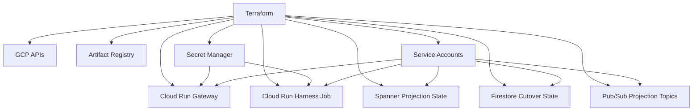
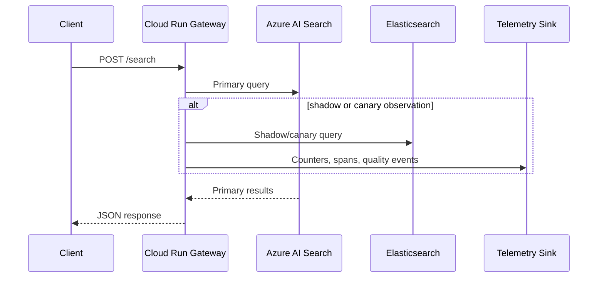

# Terraform Deployment Stack

This directory provisions the GCP-side platform infrastructure for the current codebase.

## What it deploys

- Cloud Run service for `unified_modernization.gateway.http_api:app`
- Cloud Run Job for `unified_modernization.gateway.harness`
- Artifact Registry repository for the container images
- Secret Manager secrets for gateway, backend, publisher, and OTLP credentials
- Spanner instance and database for `SpannerProjectionStateStore`
- Firestore database for `FirestoreCutoverStateStore`
- Pub/Sub topics and a projection-worker subscription for future worker wiring
- Service accounts for the gateway, harness, and future projection runtime

## What it does not claim

The repo still does not contain a concrete projection-consumer runtime that reads Pub/Sub and writes Spanner/Elasticsearch end to end. Terraform therefore provisions the projection substrate and identity now, and the actual worker deployment remains a follow-on step once that runtime entrypoint exists in code.

## Deployment view



## Runtime data flow



## Quick start

1. Build and push the container image:

```powershell
gcloud builds submit --tag us-central1-docker.pkg.dev/<project>/<repo>/unified-modernization-platform:latest .
```

2. Copy [terraform.tfvars.example](terraform.tfvars.example) to `terraform.tfvars` and replace the placeholder values.

3. Apply the stack:

```powershell
terraform init
terraform plan
terraform apply
```

4. Invoke the harness job when you are ready to collect rollout evidence:

```powershell
gcloud run jobs execute <name> --region <region> --wait
```

## Secrets

Two secret-management modes are supported:

1. `secret_values`
   Use Terraform to create the secret versions. This is the fastest bootstrap path, but it stores secret payloads in Terraform state.
2. `secret_version_refs`
   Point Terraform at an existing Secret Manager version alias or number such as `latest`.

The Cloud Run service and job accept either mode, but a given secret key must use exactly one mode. Do not set the same key in both `secret_values` and `secret_version_refs`.

Terraform always manages the Secret Manager secret containers themselves. If you want an out-of-band version lifecycle without storing payloads in Terraform state, use this two-phase workflow:

1. Apply once with `deploy_gateway_service = false` and `deploy_harness_job = false` so Terraform creates the secret containers, IAM bindings, and substrate resources.
2. Create the secret versions out of band in Secret Manager.
3. Set `secret_version_refs` for the keys you want the service or harness to mount.
4. Re-enable the workloads and apply again.

If you prefer a one-step bootstrap, use `secret_values` for the initial deployment and migrate to `secret_version_refs` later.

## Core variables

- `project_id`, `region`, `spanner_config`, `firestore_location`
- `gateway_image`
- `azure_search_endpoint`, `azure_search_default_index`, `azure_search_auth_mode`
- `elasticsearch_endpoint`, `elasticsearch_default_index`, `elasticsearch_auth_mode`
- one of `secret_values.*` or `secret_version_refs.*` for required credentials

## Security defaults

- `gateway_allow_unauthenticated = false` by default
- production gateway startup now fails closed if the search service bootstrap is invalid
- `telemetry_mode = "otlp_http"` requires `otlp_collector_endpoint`
- Secret Manager access is least-privilege: the gateway, harness, and future projection runtime only receive the secret accessor bindings they actually need

## Outputs that map to the current repo

- `gateway_service_url`, `gateway_service_name`, `harness_job_name`
- `service_accounts`, `secret_names`, `pubsub_topics`
- `projection_state_spanner`, `firestore_cutover`
- `projection_publisher_environment`
  This mirrors the env vars already consumed by `projection/bootstrap.py`.
- `projection_runtime_substrate_hints`
  These are substrate hints for a future projection worker. They are not env vars consumed by current code.

Read [TERRAFORM_DEPLOYMENT.md](../../docs/TERRAFORM_DEPLOYMENT.md) for the full rollout sequence and operational guidance.
